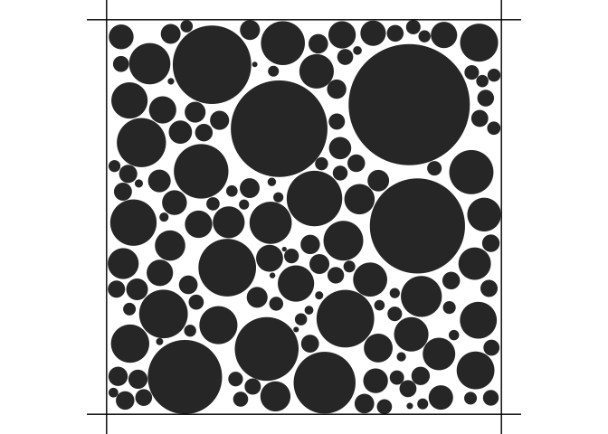

<!-- README.md is generated from README.Rmd. Please edit that file -->

# midi

<!-- badges: start -->

[](https://github.com/LMJL-Alea/midi/actions/workflows/R-CMD-check.yaml)
[](https://app.codecov.io/gh/lmjl-alea/midi?branch=main)
[](https://github.com/lmjl-alea/midi/actions/workflows/test-coverage.yaml)
[](https://github.com/lmjl-alea/midi/actions/workflows/pkgdown.yaml)
[](https://CRAN.R-project.org/package=midi)
<!-- badges: end -->

The Human brain can be seen as grey matter and white matter. The former
is composed of cell bodies and dendrites, while the latter is composed
of axons and glial cells. Neurons are made up of a cell body, dendrites,
and an axon. The cell body contains the nucleus and other organelles,
and the dendrites receive electrical signals from other neurons. The
axon is a long, thin projection that carries signals away from the cell
body to other neurons. The axons are surrounded by a myelin sheath,
which is a fatty substance that insulates the axons and speeds up the
transmission of electrical signals. The myelin sheath is not continuous,
but rather has small gaps called nodes of Ranvier. The axons are bundled
together in what is called a fiber bundle. The glial cells are
responsible for maintaining the homeostasis of the brain and providing
support and protection for the axons.

The scale of these tissues (of the order of micrometers) makes them
invisible to the naked eye. However, a robust reconstruction of the
brain microstructure is key to understanding brain function and
dysfunction. This is where diffusion magnetic resonance imaging (MRI)
comes in. Water molcules are in constant random motion due to their
thermal energy and our body is made of 80% of water. The diffusion of
water molecules in the brain is restricted by the cell membranes and
myelin sheaths, and is faster along the axons than perpendicular to
them. This anisotropic diffusion can be measured using diffusion MRI.
Diffusion MRI is a non-invasive imaging technique which makes the
magnetization of protons sensitive to the diffusion by applying
so-called magnetic field diffusion gradients. The signal attenuation in
diffusion MRI is then used to infer the microstructure of the brain.

An enormous amount of research has been done to understand the
relationship between the signal attenuation and the microstructure of
the brain and many parametric models have been devised to describe this
relationship. However, the spatial resolution of diffusion MRI is
limited by the voxel size, which is typically in the order of
millimeters, therefore containing many different tissue types. In
addition, depending on the experimental conditions (number, duration and
strength of the gradients and time between two consecutive gradients),
the MR signal might not be sensitive to all tissue types in the voxel.
The [**midi**](https://lmjl-alea.github.io/midi/) package is meant to
list the tissue models that have been proposed in the literature and to
provide tools to simulate the MR signal attenuation predicted by these
models under different experimental conditions.

The package is then used in an eponymous Shiny web application which
provides a user-friendly interface for the package and allows to
interactively visualize the MR signal attenuation induced by the
different tissue models and design experimental conditions to optimize
the sensitivity to specific tissue parameters. The Shiny web application
can be launched with the `midi::run_app()` function for convenience but
can be directly accessed at the following URL:
<https://midi-pastrami.apps.math.cnrs.fr/>.

## Installation

You can install the development version of midi from
[GitHub](https://github.com/) with:

``` r
# install.packages("devtools")
devtools::install_github("lmjl-alea/midi")
```

## Example

We can instantiate a cylinder bundle compartment as follows:

``` r
library(midi)
cylinderBundleComp <- CylinderBundleCompartment$new(
  axis = c(0, 0, 1),
  radius = 1e-5,
  diffusivity = 2.0e-9,
  cylinder_density = 0.5,
  radial_model = "soderman"
)
```

Note that the instantiation of the compartment requires the
specification of the cylinder axis, radius, diffusivity, cylinder
density, and radial model, which are only the parameters related to the
cylinder bundle geometry.

The parameters related to the experimental conditions are specified when
calling the `get_signal` method which computes the signal attenuation
for the compartment. In this example, we consider the following
experimental conditions:

``` r
cylinderBundleComp$get_signal(
  small_delta = 0.03,
  big_delta = 0.03,
  G = 0.040,
  direction = c(0, 0, 1)
)
#> [1] 0.01616863
```

We can also simulate and visualize cylinder bundles:

``` r
density <- 0.9
voxel_size <- 0.000010 # 10 micrometers
out <- simulate_bundle(density, voxel_size)
plot(out)
```



A 3D visualization of the cylinder bundle powered by the
[**plotly**](https://plotly.com/r/) package can be obtained by calling
`plot3d()`. See the documentation online at
<https://lmjl-alea.github.io/midi/reference/plot3d.html> for more
details.
