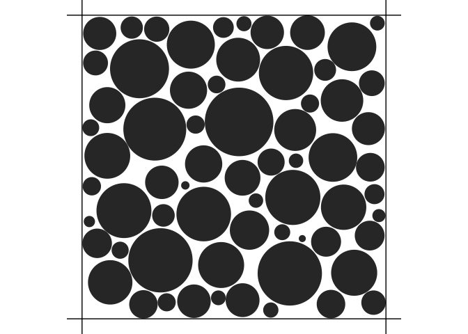

<!-- README.md is generated from README.Rmd. Please edit that file -->

# midi

<!-- badges: start -->

[](https://github.com/astamm/midi/actions/workflows/R-CMD-check.yaml)
[](https://app.codecov.io/gh/astamm/midi?branch=main)
[](https://github.com/astamm/midi/actions/workflows/test-coverage.yaml)
[](https://github.com/astamm/midi/actions/workflows/pkgdown.yaml)
[](https://CRAN.R-project.org/package=midi)
<!-- badges: end -->

The goal of midi is to provide tools for simulating MR signal
attenuations induced by diffusion of water in biological tissues. The
package is based on the theory of diffusion MRI and provides functions
for simulating the signal attenuation in pulse-gradient spin-echo MR
sequences for different tissue models.

## Installation

You can install the development version of midi from
[GitHub](https://github.com/) with:

``` r
# install.packages("devtools")
devtools::install_github("astamm/midi")
```

## Example

This is a basic example which shows you how to solve a common problem:

``` r
library(midi)
cylinderBundleComp <- CylinderBundleCompartment$new(
  axis = c(0, 0, 1),
  radius = 1e-5,
  diffusivity = 2.0e-9,
  axial_diffusivity = 2.0e-9,
  radial_diffusivity = 2.0e-10,
  cylinder_density = 0.5,
  radial_model = "soderman",
  voxel_size = c(1, 1, 1) * 1e-3
)
#> ℹ Number of cylinders: 1592
cylinderBundleComp$get_signal(
  small_delta = 0.03,
  big_delta = 0.03,
  G = 0.040,
  direction = c(0, 0, 1)
)
#> [1] 0.01619326
```

You can also simulate and visualize cylinder bundles:

``` r
density <- 0.9
voxel_size <- 0.000010 # 10 micrometers
out <- simulate_bundle(density, voxel_size)
plot(out)
```


